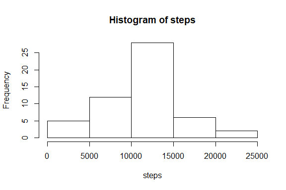

Reproducible Research, course project 1
=======================================


## 1. Loading and preprocessing the data


```r
unzip("activity.zip")
activity <- read.csv("activity.csv")
```

Convert date column to date format

```r
activity$date <- as.Date(as.character(activity$date),"%Y-%m-%d")
```

## 2. What is mean total number of steps taken per day?

Use aggregate to collapse accross interval level

```r
totalDailySteps <- aggregate(steps~date, activity, sum)
```

Make a histogram of the total number of steps taken each day

```r
with(totalDailySteps,hist(steps))
```

<!-- -->

Calculate and report the mean and median of the total number of steps taken per day

```r
meanWithNA <- mean(totalDailySteps$steps)
medianWithNA<- median(totalDailySteps$steps)
```
The mean number of steps is **10766.19** 
and the median number of steps is **10765**

## 3. What is the average daily activity pattern?

Make a time series plot of the 5-minute interval (x-axis) and the average
number of steps taken, averaged across all days (y-axis)

```r
meanStepsPerInterval <- aggregate(steps~interval, activity, mean)
names(meanStepsPerInterval)[2]="steps_mean"
plot(meanStepsPerInterval$interval,meanStepsPerInterval$steps,type="l",
     xlab="Interval",ylab="Mean number of steps")
```

<!-- -->

Which 5-minute interval, on average across all the days in the dataset, 
contains the maximum number of steps?

```r
MostActiveInt <- meanStepsPerInterval$interval[
  meanStepsPerInterval$steps_mean == max(meanStepsPerInterval$steps_mean)]
```
The **835**th 5-minute interval contains the maximum number of steps

## 4. Imputing missing values

Calculate and report the total number of missing values in the dataset
(i.e. the total number of rows with NAs)

```r
missingData <- rowSums(is.na(activity)) > 0
totalMissing <- sum(missingData)
```
Total number of missing values is **2304**

Interpolate the missing values in the dataset by using the meanStepsPerInterval
calculated in the previous steps. First divide data into table with 
missing data and table without

```r
subActivityNA <- activity[missingData,]
subActivityNotNA <- activity[!missingData,]
```

Replace NA by mean steps for that interval

```r
for (i in 1:dim(subActivityNA)[1]){
  subActivityNA[i,1] <- meanStepsPerInterval$steps_mean[
    meanStepsPerInterval$interval == subActivityNA[i,3]]
}
```

Concatenate the two tables again into one dataset

```r
activityInter <- rbind(subActivityNA,subActivityNotNA)
```

Make a histogram of the total number of steps taken each day 

```r
totalDailyStepsInter <- tapply(activityInter$steps,as.factor(
  activityInter$date),sum)
hist(totalDailyStepsInter)
```

<!-- -->

Calculate and report the mean and median total number of steps taken per day. 

```r
meanWithoutNA<-mean(totalDailyStepsInter)
medianWithoutNA<-median(totalDailyStepsInter)
```
The mean number of steps is **10766.19** 
and the median number of steps is **10766.19**

The mean number of steps without taking out the NAs was 
**10766.19** 
and the median number of steps was **10765**

As such, the mean did not change, but the median did. This makes sense, given that I 
had interpolated the missing values with the mean value, not the median value

## 5. Are there differences in activity patterns between weekdays and weekends?
Create a new factor variable in the dataset with two levels - "weekday" and "weekend" 
indicating whether a given date is a weekday or weekend day.

```r
weekdays_list <- c("Monday","Tuesday","Wednesday","Thursday","Friday")
activityInter$days <- ifelse(weekdays(activityInter$date) %in% 
                               weekdays_list,"weekday", "weekend")
```

Make a panel plot containing a time series plot type="l") of the 5-minute
interval (x-axis) and the average number of steps taken, averaged across all weekday days 
or weekend days (y-axis).

```r
weekdayStepsPerInt <- aggregate(steps~interval, activityInter[
  activityInter$days == "weekday",], mean)
weekendStepsPerInt <- aggregate(steps~interval, activityInter[
  activityInter$days == "weekend",], mean)
par(mfrow=c(2,1))
with(weekdayStepsPerInt,plot(interval,steps,type="l",
                             main="Weekdays, steps per interval"))
with(weekendStepsPerInt,plot(interval,steps,type="l",
                             main="Weekend, steps per interval"))
```

<!-- -->

There is physical activity over a longer period of the day during weekend days. 
